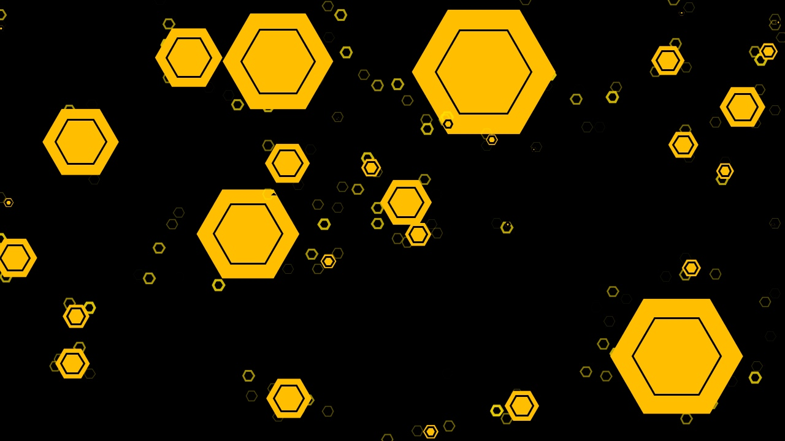

# SHAST
Códigos para envio, recepção e visualização dos dados do <strong>Sistema Habitacional de Abelhas Sem Teto</strong>.
 

<h3>Motion Detection</h3>

A pasta 'MotionDetection' cuida da detecção de movimento dentro da colméia, utilizando uma WebCam enviando as posições via OSC para o servidor do laboratório.

 

<h3>Funcionamento</h3>
O SHAST é constituido por uma colméia monitorada por uma câmera e diversos sensores com uma placa Arduino. A câmera é utilizada para localizar algumas das abelhas e enviar, através de nosso Servidor OSC, suas coordenadas X e Y. AS leituras dos sensores também são enviadas através do servidor. Todos esses valores podem ser utilizados por qualquer pessoa em qualquer lugar do mundo.

A imagem gerada é projetada em uma caixa hexagonal espelhada, causando a sensação de presença das abelhas.
Disponibilizamos aqui diversos códigos para o recebimento e visualização destes dados.

Descrição completa: http://www.nano.eba.ufrj.br/s-h-a-s-t-sistema-habitacional-para-abelhas-sem-teto/

<b>Caminhos OSC:</b> /shast/temperatura, /shast/luminosidade, /shast/umidade, /shast/solo (umidade do solo), /shast/coordenadas (2 argumentos, X e Y)
 

<h3>Processing</h3>
O Processing foi utilizado principalmente na visualização das abelhas utilizando suas posições, seja através de imagens da camera ou de coordenadas.
  - <h5>SHAST_datavis</h5>
  O projeto <strong>SHAST_datavis</strong> foi o primeiro de visualização do posicionamento das abelhas do Sistema.
    
  
   <i>Imagem da visualização das abelhas</i>

